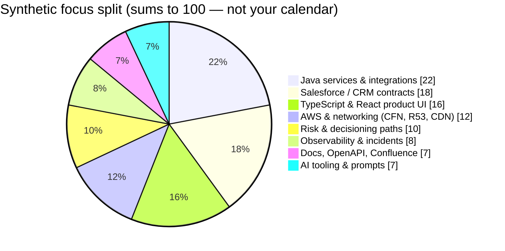
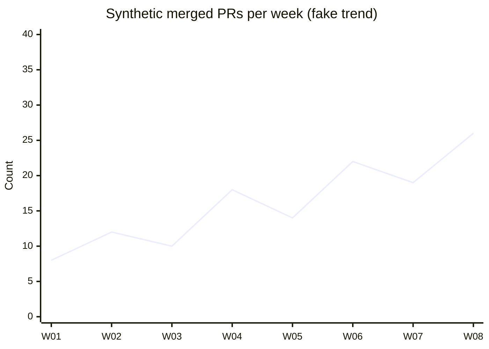
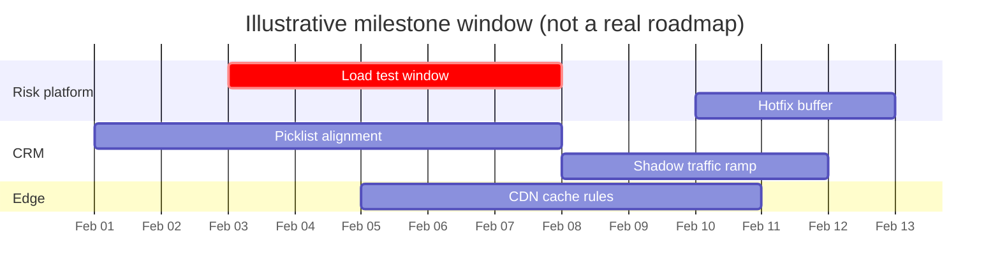
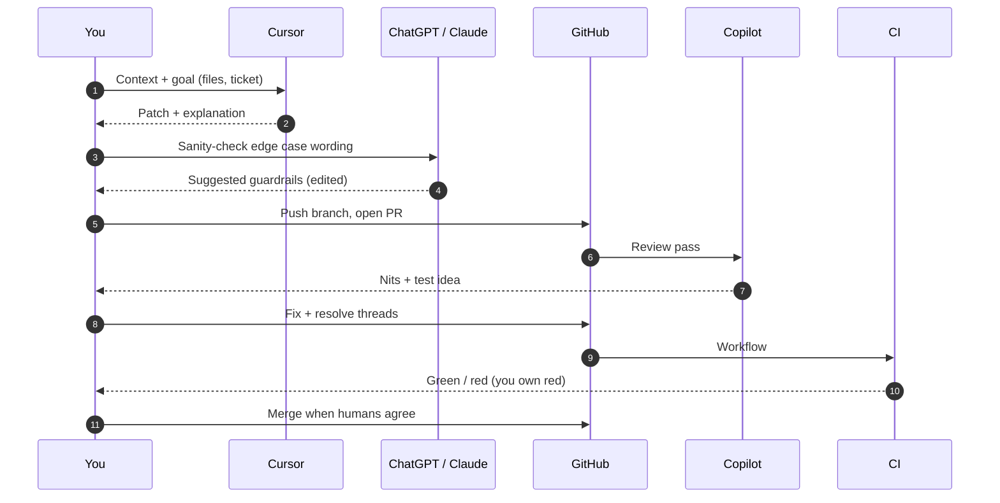
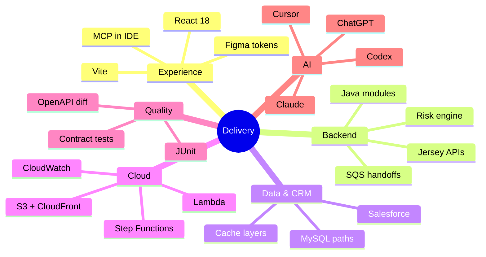
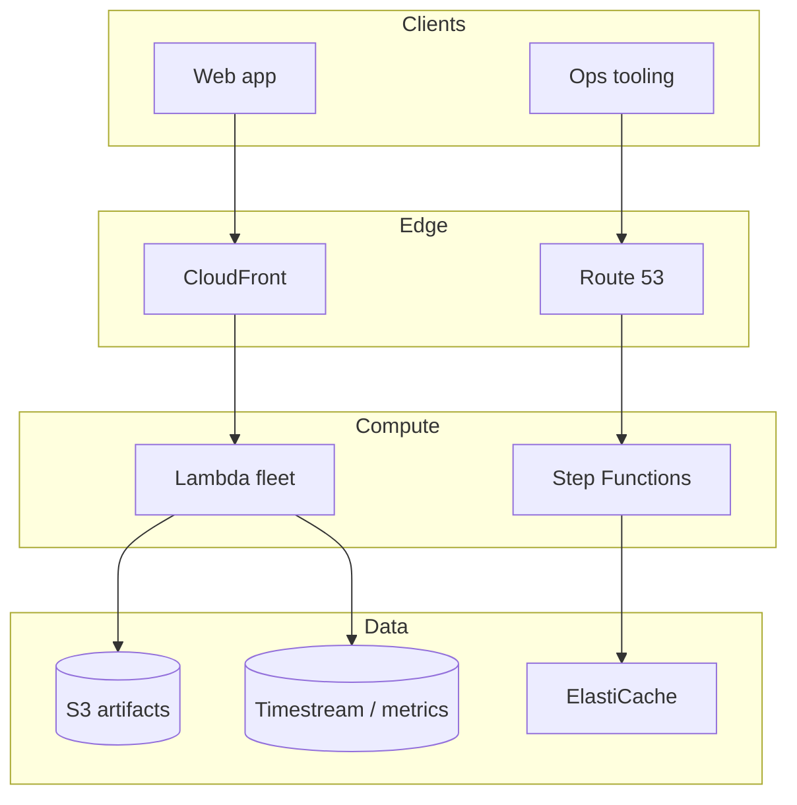
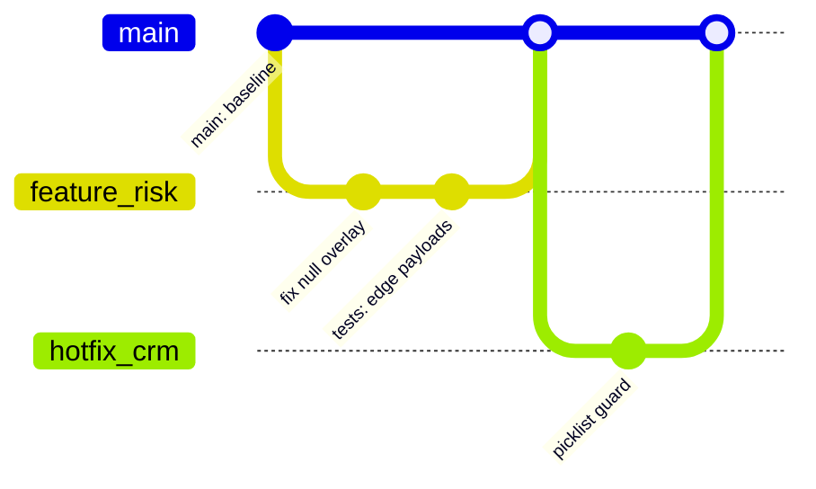

<!-- markdownlint-disable-file MD013 MD033 MD041 -->

💡 Open to ideas 
🚫 Closed to nonsense

**Tech leader**, **AI engineer**, and **software architect**. I own the thread from **what users see** to what runs in prod: **APIs**, **data flows**, **Salesforce-shaped** integrations, and the boring stuff that keeps services alive—**metrics**, **deployments**, **failure modes**. “Architecture” isn’t a diagram; it’s what you debug at 2 a.m. when something subtle breaks in **serialization** or **CRM** sync.

Right now I’m **shipping new products** with **Figma** in the loop and **MCP servers** hooked into my **IDE**, so design tokens and code don’t drift into two competing truths.

Day to day I live in **TypeScript/React** on one side and **enterprise Java** on the other, with **Salesforce** as the third character in the play—**mortgage** flows, **risk** calls, regulated data, and systems that have to stay **observable** and **safe to change** when the domain throws another edge case.

- **Product & delivery** — Shipped beats clever. Clear scope, iterations you can review, and outcomes you can point at—not refactors nobody asked for.
- **Architecture & reliability** — **HTTP** boundaries, versioning traps, performance when it matters, and production reality: **CI**, **metrics**, **what happens when the call fails**.
- **Lending & CRM** — Loan lifecycles, **CRM** objects and picklists, and being strict about **nulls** and unknowns so we never “accidentally” serialize the wrong default into Salesforce.
- **Risk & decisioning** — Mortgage **risk** engines: domain logic you can test, **HTTP** contracts you can trust, and defensive code when the request is half-empty—because it will be.
- **Web stack** — **TypeScript**, **JavaScript**, **React**, **Node**, plus **containers** and cloud primitives when the problem isn’t “more YAML,” it’s “make it repeatable.”
- **Docs & APIs** — **OpenAPI**, **Postman**, **Markdown**—whatever makes the next person (or future me) not guess what the integration actually does.
- **How work gets tracked** — **Jira**, **Confluence**, **GitHub PRs**. If it isn’t in the ticket or the PR, it didn’t happen.
- **Mindset** — Still: open to ideas; closed to nonsense.

**Focus:** *Systems you can change without heroics—and “works on my machine” doesn’t count.*

*Most of what I’m proud of sits in **private org** repos. The **Featured work** table names it; **GitHub stats** here are only the public slice.*

---

## 💻 Tech Stack

**Languages & config**  

**Frontend**  

**State management**  

**Enterprise Java, REST APIs & testing**  
-007396?style=flat&logo=openjdk&logoColor=white)

**Backend, data & CRM**  

**DevOps, cloud & AWS**  

*Recent **AWS** work (the stuff that actually shows up in my console): **Firewall Manager**, **Systems Manager**, **CloudWatch**, **Lambda**, **S3**, **CloudFront**, **Route 53**, **Timestream**, **ElastiCache**, **MemoryDB**, **Step Functions**, **Amplify**, **EFS**, **Storage Gateway**—plus the usual suspects elsewhere in the stack (**SQS**, **K8s**, etc.).*

**CI/CD, build & collaboration**  

**Integration patterns**  

**LLM tools (ChatGPT, Claude, Codex)**  

---

## ⭐ Featured work (private / internal repositories)

| Repository | What it is |
| :--- | :--- |
| `limited_wecheck` | The big **Gradle** monorepo: **mortgage** plumbing, **Salesforce** builders and connectors, **loan** models, the **risk** engine over **HTTP** (with tests for the ugly inputs), DALs, shared **monitoring**. You’ll bump into **`CRMBuilder`**, **`DataModel`**, **`MortgageLoanRiskEngine`**, **`BL`**, **`common.monitoring`**—that’s the shape of it. |
| `serverless` | **Lambdas**, **SQS**, schedulers, thin **HTTP** surfaces—stuff that shouldn’t live in the long-running monolith: notifications, **CRM** sync requests, anything **event-driven** that wants to scale independently. |
| `devops_infra` | **Helm**, **Kubernetes**, env wiring: **ingress**, **TLS**, getting **risk** / **CRM** URLs consistent across **dev/stage/prod**, **secrets** done sensibly, and **CI** artifacts actually landing where the cluster expects them. |
| `frontend` | **React** / **TypeScript** apps for **lending** and **ops**: **REST**-backed flows, **CRM**-honest state, same vocabulary as the **Java** and **serverless** pieces. |
| `docs` | **OpenAPI**, **Postman**, **Markdown**, **Confluence**—error shapes, integration semantics, **TLS** / **OAuth** notes. One place so **eng**, **architecture**, and **QA** aren’t arguing from three different PDFs. |

*Private org—names only, no links. Tweak labels if your team calls these something else.*

---

## 🤖 AI-assisted engineering

This is part of the job, not a party trick. I use **AI** like a fast **senior pair**: great at search, scaffolding, and bouncing across files—**not** an oracle. Nothing ships without **my** eyes on the diff, **tests** where they matter, **linters** where we agreed them, and the same bar as any other change (**production** is off-limits unless someone explicitly says go).

Alongside **Cursor**, I reach for **ChatGPT**, **Anthropic Claude**, and **OpenAI Codex** when I want a second brain: sketch a refactor, untangle an error message, or draft something I’ll still edit before it touches a repo. Same rule: **models suggest**; **I** decide what merges.

| Area | Tools & setup | What I actually do | Where I don’t let the model wing it |
| :--- | :--- | :--- | :--- |
| **IDE work** | [**Cursor**](https://cursor.com/) (agent / composer), multi-file edits, **terminal**, repo-wide search | **Java** refactors (**CRM** builders, mortgage handlers, **risk** paths), **TypeScript/React**, **Gradle** nits, long **stack traces**—plus test scaffolding and “what if we restructured this?” before I touch half the tree. | I **read every diff**, run **build/tests**, and say no to clever ideas that break **serialization**, **null** rules, or **Salesforce** contracts. |
| **PRs** | **GitHub Copilot** on reviews | I take Copilot comments seriously when they’re right; I **fix**, **resolve** threads, keep **Conventional Commits** and **ticket keys** so the PR tells a story. | Copilot doesn’t merge the PR. **Humans** and **CI** do. |
| **Skills / APIs** | **Cursor** skills: **Salesforce** (**OAuth** / **REST**), **Jira**, **Confluence**, **MySQL** (read-only), **GitHub** issues | Scripted flows with explicit **intent** and **environment**—queries, ticket updates, pages, issues—so I’m not retyping the same curl for the tenth time. | **Secrets** live in **env**. **Destructive** stuff waits for a **yes**. I still verify with **curl**, DB tools, the UI—whatever matches reality. |
| **Docs & handoffs** | **Markdown**, **OpenAPI**, **Postman**, **Confluence** | First drafts of specs, error tables, integration notes, **handoff** blobs (ticket, files, **picklist** semantics) so the next session isn’t archaeology. | Ground truth is **describe**, **real HTTP**, and **the repo**—not whatever sounded confident in prose. |
| **Huge repos** | Same stack; search + context | Trace **BL → risk**, **CRM** sync, **Lambda** neighbors; sanity-check dependencies before a big move—especially when a file has **thousands** of lines and nobody’s brave enough to print it. | **Git** and **runtime** win arguments. AI gives me a map; it doesn’t own the terrain. |
| **Lint** | **markdownlint**, language linters, format-on-save | Fix style **in the same PR** as the feature; keep this README from turning into a free-form novel. | I don’t blanket-disable rules unless there’s a **reason** (e.g. HTML in a profile README). |

---

## Visuals & diagrams

*The **Mermaid** blocks below use **fabricated demo data**—numbers, dates, and labels are there to show what “rich” charts look like in a profile README, not to report real KPIs. Further down, **image widgets** pull **live public GitHub** data (stats, streak, activity graph, etc.); treat those as the real signal unless you swap them off later.*

### Mock focus mix (pie — demo data)

### Mock throughput (line — demo data)

### Mock release train (Gantt — demo data)

### AI + human PR loop (sequence — demo labels)

### Stack & concerns (mindmap — demo layout)

### Mock service map (flowchart — demo)

### Mock git graph (demo branches)

---

### Live GitHub widgets (real public data)

*These images call third-party services that read **your public GitHub** profile—stars, languages, streak, contribution graph, etc. They are **not** the mock Mermaid section above.*

#### Contribution activity & profile cards

  

  <table>
    <tr>
      <td align="center">
        
      </td>
      <td align="center">
        
      </td>
    </tr>
    <tr>
      <td align="center" colspan="2">
        
      </td>
    </tr>
  </table>

---

## 📊 GitHub stats

  <table>
    <tr>
      <td align="center">
        
      </td>
      <td align="center">
        
      </td>
    </tr>
  </table>

  

## 🏆 GitHub trophies

  

<!-- Trophies: official github-profile-trophy.vercel.app often returns 503; gh-trophy.cdnsoft.net is a community mirror from upstream load-balancer list. -->

---

## 🌐 Connect

---

<!-- Suggested GitHub repository "About" (paste in repo Settings): description: "Tech leader, AI engineer & software architect — web, APIs, Java, Salesforce, cloud, lending." topics: architecture, leadership, ai-engineering, typescript, react, java, salesforce, kubernetes, mortgage, fintech, apis -->
