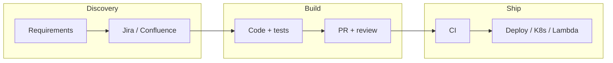
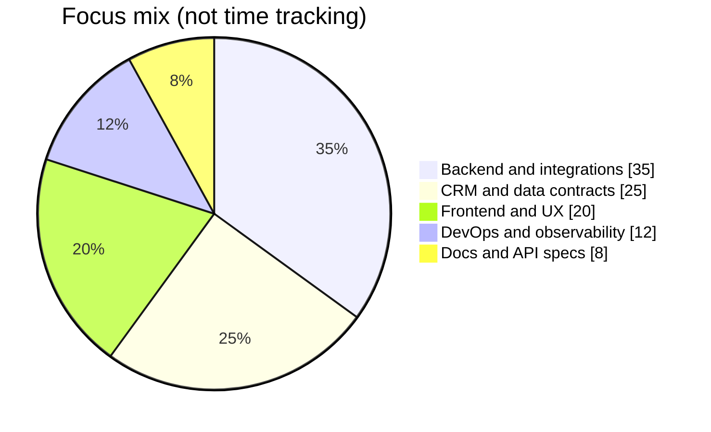
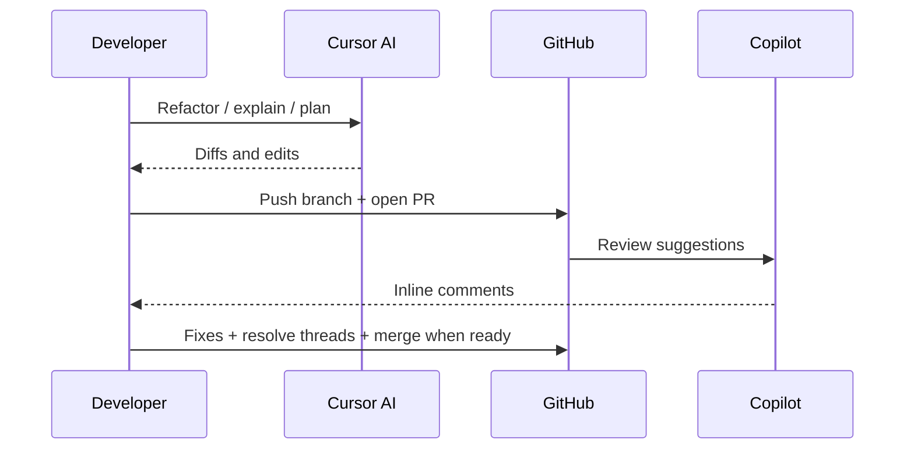
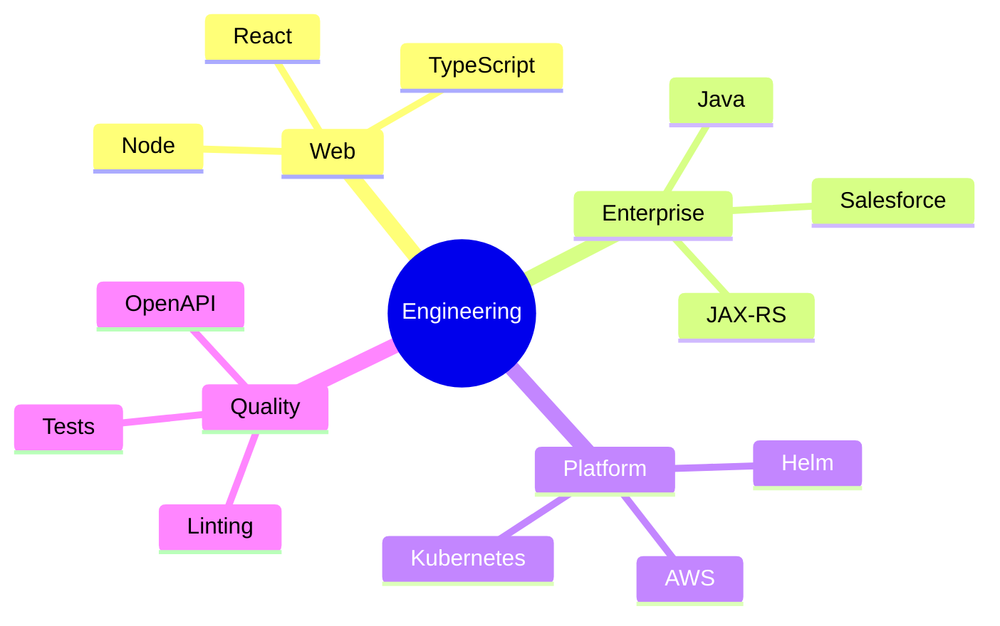

<!-- markdownlint-disable-file MD013 MD033 -->

# Hi, I'm Tom Goldberg

**Software engineer (full-stack + integration-heavy)** — I build customer-facing web products **and** the services behind them: APIs, data flows, CRM integrations, and operational tooling. Comfortable owning a feature from **UX and contracts** down to **deployments and observability**.

Day to day I bridge **modern TypeScript/React** stacks with **enterprise Java services**, third-party **CRM (Salesforce-oriented)** boundaries, and **regulated-domain** correctness—loan and mortgage workflows, risk and decisioning paths, and keeping distributed systems observable and safe to change.

- **Product & delivery** — Requirements to shippable increments: clear scope, iteration, reviews, and measurable outcomes—not endless refactors without user value.
- **Architecture & reliability** — Service boundaries, HTTP APIs, serialization and versioning pitfalls, performance, and production concerns (deployments, metrics, failure modes).
- **Lending & CRM integration** — Loan-application lifecycles, synchronizing core services with CRM objects and picklists, and careful handling of nulls and unknowns so payloads never imply bogus defaults.
- **Risk & decisioning services** — Mortgage/loan risk engines and related domain logic: testable core code, clear HTTP boundaries, and defensive handling when upstream data is incomplete.
- **Modern web stack** — TypeScript / JavaScript, React, Node, and automation from CI/CD through containers and cloud primitives.
- **Docs & API discipline** — OpenAPI-style specs, Postman collections, and technical write-ups so architects and other teams can align without tribal knowledge.
- **Delivery toolchain** — Jira-driven work, Confluence for durable specs, GitHub PRs, and the usual suspects for reviewable, traceable changes.
- **Mindset** — Open to ideas; closed to nonsense.

**Focus:** *Maintainable systems in complex domains—where “it works on my machine” is never enough.*

*Most of my deepest work lives in private org repositories—the stack below and the **Featured work** section describe that side; GitHub stats reflect public activity only.*

---

## 💻 Tech Stack

*Web and product on one side; enterprise Java, APIs, CRM, and cloud on the other—aligned with how we build and ship in practice.*

**Languages & config**  

**Frontend**  

**State management**  

**Enterprise Java, REST APIs & testing**  
-007396?style=flat&logo=openjdk&logoColor=white)

**Backend, data & CRM**  

**DevOps, cloud & AWS**  

**CI/CD, build & collaboration**  

**Integration patterns**  

---

## ⭐ Featured work (private / internal repositories)

**No hyperlinks**—these live in a private org and are listed here **by name only** so visitors see where the real depth is (GitHub stats alone won’t show it).

| Repository | What it is |
| :--- | :--- |
| `limited_wecheck` | Primary **Gradle** multi-module platform for **mortgage / lending**: business-logic and mortgage orchestration, **Salesforce CRM** builders and connectors, **loan-application** data models, HTTP-facing **mortgage loan risk** engine (with tests for incomplete / edge-case input), DALs, and shared **monitoring** plumbing. Major areas inside the tree include **`CRMBuilder`**, **`DataModel`**, **`MortgageLoanRiskEngine`**, **`BL`**, and **`common.monitoring`**. |
| `serverless` | **AWS Lambda**–centric delivery: fat JAR builds, **SQS** consumers and producers, scheduled jobs, and thin **HTTP** APIs that complement the core platform—notifications, CRM sync requests, and other **event-driven** paths that should not live in the long-running monolith. |
| `devops_infra` | **Helm**, **Kubernetes**, and **environment** wiring: charts, **ingress** / **TLS**, **config** alignment (e.g. **risk** and **CRM** service URLs across **dev/stage/prod**), **secrets** patterns, and the glue between **CI** output and **runtime** clusters. |
| `frontend` | **React** / **TypeScript** (and related UI stack) for **lending** and **operations** experiences: flows backed by **REST** APIs, **CRM**-consistent state, and the same **domain** language as the **Java** and **serverless** tiers. |
| `docs` | **OpenAPI** specs, **Postman** collections, **Markdown** handbooks, and **Confluence**-linked write-ups—**integration** semantics, error catalogs, and **TLS** / **OAuth** notes so **engineering**, **architecture**, and **QA** align on contracts. |

*Names are plain text only (private org). Adjust wording anytime to match how your team describes these repos.*

---

## 🤖 AI-assisted engineering

I treat **AI as a senior pair**—fast at search, scaffolding, and cross-file reasoning—not as a source of truth. Everything ships through **human review**, **tests**, **linters**, and the same **change-management** bar as any other commit (including **no production changes** without explicit approval).

| Area | Tools & setup | What I actually do with AI | How I keep quality high |
| :--- | :--- | :--- | :--- |
| **IDE pair programming** | [**Cursor**](https://cursor.com/) (agent / composer), multi-file edits, integrated **terminal**, repo-wide search | **Refactors** across **Java** modules (e.g. CRM builders, mortgage handlers, risk paths), **TypeScript/React** UI work, **Gradle** touchpoints, and **debugging** long traces; **scaffolding** tests and handlers; **planning** larger changes before touching code. | I **read diffs**, run **builds/tests**, and reject clever shortcuts that break **serialization**, **null** semantics, or **CRM** contracts. |
| **PR review loop** | **GitHub Copilot** reviews on pull requests | **Pull** Copilot comments, **implement** what I agree with, **resolve** threads with matching code, and keep **Conventional Commits** + **ticket keys** consistent so reviews stay actionable. | I **don’t merge** on AI approval alone—**team review** and **CI** still rule. |
| **Repeatable “skills” & APIs** | **Cursor agent skills** (Salesforce **OAuth/REST**, **Jira**, **Confluence**, **MySQL** read-only, **GitHub** issues, etc.) | **Structured CRUD** and **read-only** queries against **dev/staging** orgs, **issue** updates, **page** edits, and **issue** creation—**prompted** with explicit **intent** and **environment** so runs stay predictable. | **Secrets** stay in **env**; **destructive** actions need **explicit OK**; I **validate** responses with normal tooling (**curl**, DB clients, UI). |
| **Docs, specs & handoffs** | **Markdown**, **OpenAPI**, **Postman**, **Confluence**-oriented content | **Draft** and **iterate** on **API** specs, **error** tables, **integration** notes, and **agent handoff** docs (ticket context, file pointers, **Salesforce** picklist semantics) so the next human or session isn’t guessing. | **Facts** are checked against **describe** output, **real HTTP** responses, and **code**—AI prose is **edited**, not pasted blindly. |
| **Large-codebase navigation** | Same IDE stack; **semantic** search + file context | **Map** flows across **modules** (e.g. **BL → risk** HTTP, **CRM** sync, **Lambda** adjacency), **summarize** dependencies, and **spike** options before a big move—especially useful on **4k-line**-class files and **multi-repo** work. | **Ground-truth** is always **git** + **runtime**; AI summaries are a **starting point**. |
| **Linting & hygiene** | **markdownlint**, language-specific linters, **format-on-save** where applicable | **Fix** lint and style issues **in the same change** as the feature; keep **README** and **docs** consistent with project rules. | **Zero** “ignore lint” unless there’s a **documented** reason (e.g. profile README HTML). |

*If you use additional tools (e.g. ChatGPT Enterprise, internal LLMs), add a row—this table reflects what I’ve wired into my daily workflow today.*

---

## Visuals & diagrams

*Charts below mix **Mermaid** (rendered by GitHub) with **hosted SVG cards**—same **dracula**-style palette as the stats widgets for a cohesive look. Pie slices are **illustrative**, not measured hours. The **commits-by-hour** card uses `utcOffset=2`; edit the README if you want another timezone.*

### How work flows (delivery)

### Where engineering attention goes (illustrative)

### AI in the PR loop

### Stack map (mindmap)

### Contribution activity & profile cards

  

  <table>
    <tr>
      <td align="center">
        
      </td>
      <td align="center">
        
      </td>
    </tr>
    <tr>
      <td align="center" colspan="2">
        
      </td>
    </tr>
  </table>

---

## 📊 GitHub stats

  <table>
    <tr>
      <td align="center">
        
      </td>
      <td align="center">
        
      </td>
    </tr>
  </table>

  

## 🏆 GitHub trophies

  

### Other public repositories

Recently updated (see also [all repositories](https://github.com/tomm1990?tab=repositories)):

- [tolstoy.api.url](https://github.com/tomm1990/tolstoy.api.url)
- [tolstoy.api.auth](https://github.com/tomm1990/tolstoy.api.auth)
- [looks](https://github.com/tomm1990/looks)
- [adam](https://github.com/tomm1990/adam) — Computer Science

---

## 🌐 Connect

---

<!-- Suggested GitHub repository "About" (paste in repo Settings): description: "Full-stack engineer — web, APIs, Java services, Salesforce CRM, cloud & lending-tech integrations." topics: full-stack, typescript, react, java, salesforce, kubernetes, mortgage, fintech, apis -->
